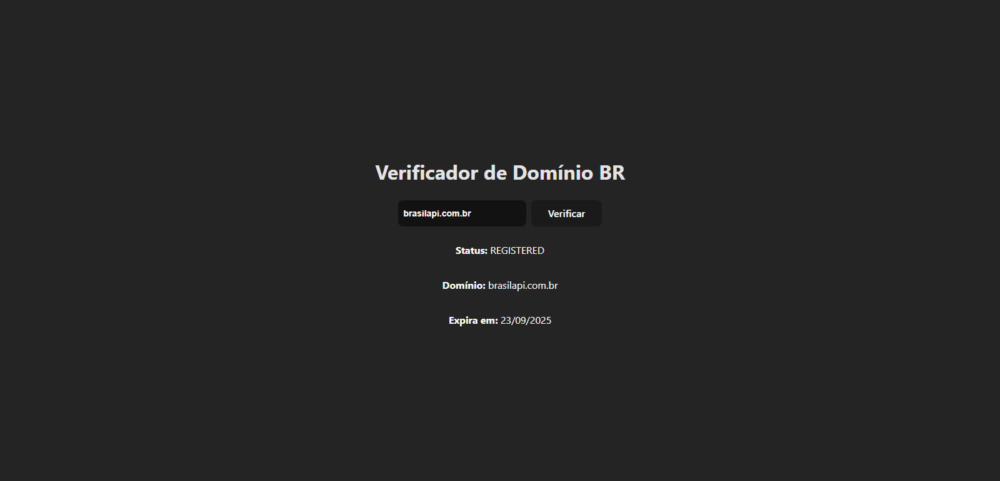
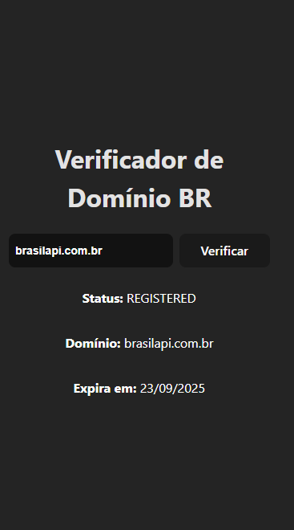

# Project Domain Check (To use an external API) 

Practical Web Programming Activity

The goal was to create a simple website. The goal was to develop only the frontend of the project to practice the concepts taught in class and use an external API where suggestions were given. The Registro.br API was chosen, where the user enters a URL and the website checks and returns the data from that URL to the user. The project was initially built using HTML, CSS and JavaScript and after a migratory period to React.

After the initial completion of the project using pure HTML, CSS and JavaScript, I migrated to React out of curiosity, to learn a little more about how it works and also for study. I think it's a really cool tool and this is a start where I'll practice a lot more using React to build cool things.

### 🛠️ Technologies Used:
- React
- Vite
- Registro.br
- CSS
- JavaScript

📧 Send me an email: henrykaua21@gmail.com 

🔗 Connect with me on [LinkedIn](https://www.linkedin.com/in/henry-kaua/)

🐛 Open an [issue](https://github.com/henrymzs/domain-query/issues) in the repository 

Any help is greatly appreciated and contributes to my growth as a developer. 🚀

### 🏃 Steps to Install and Run:
1. Clone this repository:
```bash
   git clone https://github.com/henrymzs/domain-query.git
```
2. Install React project dependencies:
```bash
    npm install
```
3. Start the local server:
```bash
    npm run dev
```

### You will see something like this in your code editor's terminal. Copy the localhost URL and paste it into your preferred browser. This will display the project's home screen.
```bash
     VITE v6.3.2  ready in 160 ms

    ➜  Local:   http://localhost:PORT/
    ➜  Network: use --host to expose
    ➜  press h + enter to show help
```


### Project result on desktop:



### Project result on mobile:

