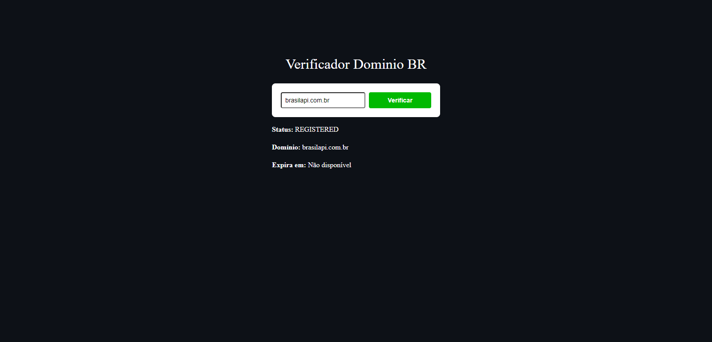
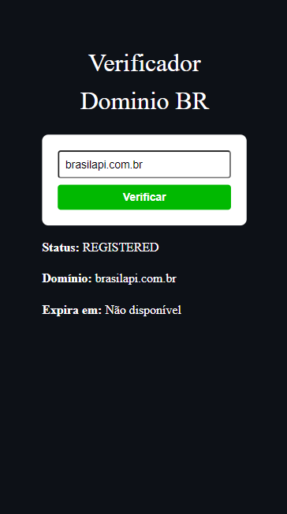

# Project Domain Check (To use an external API) 

Practical Web Programming Activity

The goal was to create a simple website. The goal was to develop only the frontend of the project to practice the concepts taught in class and to use an external API where suggestions were given and the Registro.br API was chosen where the user enters a URL and the website checks and returns the data from that URL to the user. The project was built using HTML and CSS.

Objectives:
- Use External API

- Style page elements using CSS, including layout, colors and typography.

- Implement a responsive design that adapts to different screen sizes.

- Use CSS positioning and Flexbox concepts.

📧 Send me an email: henrykaua21@gmail.com 

🔗 Connect with me on [LinkedIn](https://www.linkedin.com/in/henry-kaua/)

🐛 Open an [issue](https://github.com/henrymzs/domain-query/issues) in the repository 

Any help is greatly appreciated and contributes to my growth as a developer. 🚀

Project Desktop:

Project Mobile:

